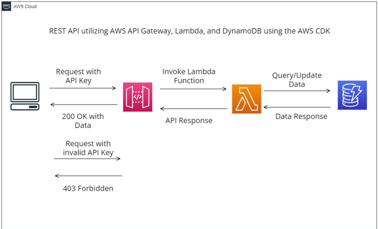
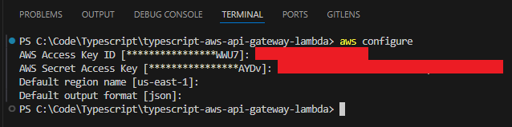
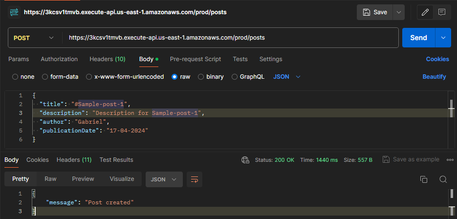
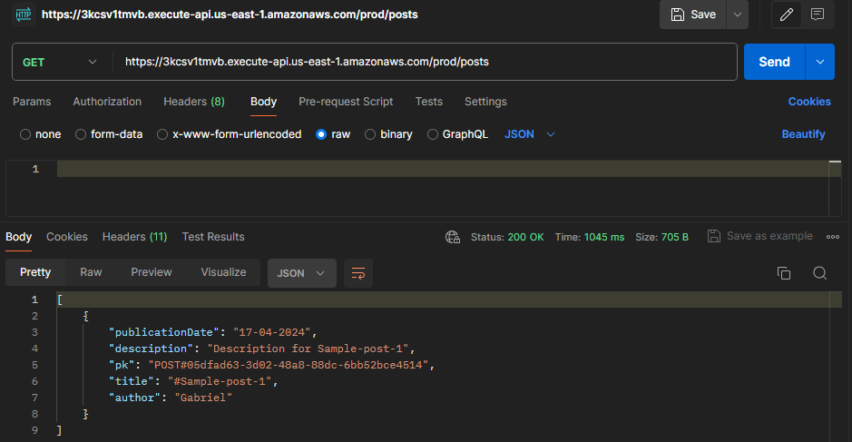

# To implement and test a REST API with AWS API Gateway, Lambda, and DynamoDB with the AWS CDK using TypeScript

To implement a REST API with API key authentication using AWS API Gateway, DynamoDB, Lambda, and the AWS CDK using TypeScript as well as how to test it with Postman.

## Overview

APIs play a crucial role in the developer world by facilitating seamless connections between disparate systems and products. As developers, it's highly probable that at some point in our journey, we will leverage APIs to enhance our projects. Today, we will explore the creation of an API using AWS services such as API Gateway, Lambda, DynamoDB, and the AWS CDK.

The primary motivation behind creating an API is to provide external developers with a straightforward means to integrate with our product or platform, enabling them to perform operations as if they were interacting directly with the product.

By the conclusion of this README file, we will have developed an exemplary REST API. This API will enable users to perform essential CRUD (Create, Read, Update, Delete) operations on blog posts stored in a DynamoDB table. Additionally, we will implement security measures by mandating the use of an API key in requests, ensuring that only authenticated requests are processed while unauthorized ones receive a 403 Forbidden response.

## Architecture diagram



## Prerequisites
1. AWS Account : To utilize with the AWS CDK, you must have an AWS account and credentials and a corresponding access key. If you don’t have an AWS account yet, see [Create and Activate an AWS Account](https://repost.aws/knowledge-center/create-and-activate-aws-account).

2. NodeJS: All AWS CDK applications require Node.js 10.13 or later, even if you work in Python, Java, C#, or Go. You may download a compatible version at nodejs.org.

3. TypeScript: You also need TypeScript itself (version 3.8 or later). If you don’t already have it, you can install it using npm.To install TypeScript globally, run the following command:


    ```sh
    npm install -g typescript
    ```

    Test the installation by issuing 

    ```sh
    tsc -v
    ```

    Keep TypeScript up to date with a regular

    ```sh
    npm update -g typescript
    ```

4. AWS CDK Toolkit: After installing Node.js, install the AWS CDK Toolkit (the cdk command)

    ```sh
    npm install -g aws-cdk
    ```
    Test the installation by issuing 
    
    ```sh
    cdk --version
    ```

    After installation, set up your workstation with your AWS credentials
    write following command in terminal

    ```sh
    aws configure
    ```
    - Enter your Access Key Id and press enter
    - Now, Enter your Secret Access Key and press enter

    Now, define default region name and output format and press enter
    this will configure your AWS credentials.

    


## Creating a AWS CDK Typescript project

Each AWS CDK app should be in its own directory, with its own local module dependencies. Create a new directory for your app

```sh
mkdir test-project
cd test-project
```

Now initialize the app by using the cdk init command. Specify the desired template (“app”) and programming language as shown in the following examples:

```sh
cdk init app --language typescript
```

The cdk init command creates a number of files and folders inside the test-project directory to help you organize the source code for your AWS CDK app.
Creating a project also installs the aws-cdk-lib module and its dependencies.

## Building, synthesizing, and deploying

Generally, you should be in the project’s root directory when building and running your application.

1. **Build the app:** Node.js doesn't execute TypeScript directly. Instead, TypeScript code is compiled into JavaScript using the TypeScript compiler (tsc), and the resulting JavaScript is what Node.js executes. Manually compiling TypeScript can be helpful for error-checking and running tests. To compile your TypeScript application manually, use the command npm run build. You can also use npm run watch to enable watch mode, where the TypeScript compiler automatically rebuilds your application whenever you save changes to a source file.

2. **Synthesize an AWS CloudFormation template:** To generate an AWS CloudFormation template from the stacks defined in your AWS CDK app, use the command cdk synth. This command synthesizes the CloudFormation template based on the definitions in your CDK app.

3. The cdk synth command runs your AWS CDK app, converting its resource definitions into an AWS CloudFormation template. The output of cdk synth is a YAML-format CloudFormation template, which is also saved in the cdk.out directory in JSON format.

To deploy the stack using the AWS CDK Toolkit, you can use the cdk deploy command. This command deploys the CloudFormation stack based on the synthesized template. It's recommended to run cdk synth before deploying to ensure that the latest changes are reflected in the CloudFormation template.

```sh
cdk deploy
``` 

displays progress information as your stack is deployed. When it's done, the command prompt reappears. You can go to the [AWS CloudFormation console](https://console.aws.amazon.com/cloudformation/home) and see that it now lists TestProjetcStack

Finally, we need a way of testing the API we build. You could opt for something like `curl` but I’d recommend using Postman as it provides a nice UI for testing APIs and their responses.

## DynamoDB

The following steps demonstrate how to define a new DynamoDB table in your CDK Stack for storing post data created via your API.

Add the following code to define the new DynamoDB table:

```typescript
   const dbTable = new Table(this, 'DbTable', {
      partitionKey: { name: 'pk', type: AttributeType.STRING },
      removalPolicy: cdk.RemovalPolicy.DESTROY,
      billingMode: BillingMode.PAY_PER_REQUEST,
    });
```

This code creates a new DynamoDB table named PostsTable with a partition key named pk, using on-demand billing mode, and set to be removed when the stack is deleted to avoid leaving any lingering data.

## API Gateway

After defining the DynamoDB table, the next step is to create a new REST API in API Gateway and generate an API key for use with the API. Follow these steps:

Add the following code to create the REST API:

   ```typescript
   import * as apigateway from '@aws-cdk/aws-apigateway';

   const api = new RestApi(this, 'RestAPI', {
      restApiName: 'RestAPI',
      defaultCorsPreflightOptions: {
        allowOrigins: Cors.ALL_ORIGINS,
        allowMethods: Cors.ALL_METHODS,
      },
      apiKeySourceType: ApiKeySourceType.HEADER,
    });

   const apiKey = api.addApiKey('PostsApiKey');
   ```
   This code creates a new REST API named Posts API in API Gateway with CORS options configured to allow all origins and methods. It also generates a new API key named PostsApiKey.

## Usage Plan

After defining the DynamoDB table and creating the REST API in API Gateway, the next step is to configure a usage plan for the API and associate the API key with the usage plan. Follow these steps:

Add the following code to create the usage plan and associate the API key:

   ```typescript
   const usagePlan = new apigateway.UsagePlan(this, 'PostsUsagePlan', {
       name: 'PostsUsagePlan',
       apiStages: [{
           api: api,
           stage: api.deploymentStage
       }]
   });

   usagePlan.addApiKey(apiKey);
   ```

   This code creates a new usage plan named PostsUsagePlan for the specified API. It associates the usage plan with the default stage of the API and adds the previously generated API key to the usage plan.

## Lambda

With the base of our new API configured, we’re now ready to move on to defining our Lambda functions and handlers, which will contain the actual logic used when a user sends a request to our API.

Add the following code to define the Lambda functions:

   ```typescript
   const postsLambda = new NodejsFunction(this, 'PostsLambda', {
      entry: 'resources/endpoints/posts.ts',
      handler: 'handler',
      environment: {
        TABLE_NAME: dbTable.tableName,
      },
    });

    const postLambda = new NodejsFunction(this, 'PostLambda', {
      entry: 'resources/endpoints/post.ts',
      handler: 'handler',
      environment: {
        TABLE_NAME: dbTable.tableName,
      },
    });
   ```

   This code defines two Lambda functions: **createPostFunction** and **getPostFunction**. Each function specifies its runtime, handler file path, code location, and environment variables, including the DynamoDB table name.

## Granting read/write permissions

After defining the Lambda functions, the final thing we need to do is to grant them the necessary permissions to be able to read and write to our DynamoDB table which we can achieve with the below code.

```typescript
   dbTable.grantReadWriteData(postsLambda);
   dbTable.grantReadWriteData(postLambda);
```
## Creating our handlers

Now that our Lambda functions are defined and have the necessary permissions to run, we can proceed with creating them. This involves creating new files and directories to contain the code for the Lambda functions and the handler functions they will use to access the database and perform operations.

```sh
aws-ts-cdk-rest-api                                                           
├─ bin                                                                   
│  └─ aws-ts-cdk-rest-api.ts                                                  
├─ cdk.out                            
├─ images      
├─ lib                                            
│  └─ aws-ts-cdk-rest-api-stack.ts                                            
├─ resources                                                                  
│  ├─ endpoints                                                            
│  │  ├─ post.ts                                                                  
│  │  └─ posts.ts                                                             
│  └─ handlers                                                                
│     └─ posts                                                       
│        ├─ create.ts                                                        
│        ├─ delete.ts                                                      
│        ├─ get-all.ts                                                       
│        └─ get-one.ts                                                        
├─ test                                            
│  └─ aws-ts-cdk-rest-api.test.ts                                                             
├─ package-lock.json                                                          
├─ package.json                                                               
├─ README.md                                                                  
├─ tsconfig.json                                                                   
└─ types.ts
```

After creating the necessary files and folders, your project structure should include a resources directory at the root, alongside the lib and bin directories. Inside the resources directory, you should have all the files required for your Lambda functions to run.

Before populating these files with code, there are a few steps to take:

Install AWS NPM packages: Use npm i `@aws-sdk/client-dynamodb @aws-sdk/lib-dynamodb @types/aws-lambda aws-lambda` to install packages for accessing and operating on the DynamoDB table, and for TypeScript types.

Define a type for post data: Create a new file called types.ts in the root of your project and add the following code to define a type for post data:

```typescript
export interface IPost {
    title: string;
    description: string;
    author: string;
    publicationDate: string;
  }
```

Now that we've completed the necessary setup, we can populate the files we created with the required code. Below, you'll find the complete code snippets for each file we created earlier.

## Endpoints

```typescript
import { APIGatewayProxyEvent } from 'aws-lambda';
import { getOne } from '../handlers/posts/get-one';
import { deletePost } from '../handlers/posts/delete';

export const handler = async (event: APIGatewayProxyEvent) => {
  const id = event.pathParameters?.id;

  if (!id) {
    return {
      statusCode: 400,
      body: JSON.stringify({ message: 'Missing path parameter: id' }),
    };
  }

  try {
    // Handle different HTTP methods
    switch (event.httpMethod) {
      case 'GET':
        return await getOne({ id });
      case 'DELETE':
        return await deletePost({ id });
      default:
        return {
          statusCode: 400,
          body: JSON.stringify({ message: 'Invalid HTTP method' }),
        };
    }
  } catch (error) {
    // eslint-disable-next-line no-console
    console.log(error);

    return {
      statusCode: 500,
      body: JSON.stringify({ message: error }),
    };
  }
};
```

The provided code is designed for our `/posts/{id}` endpoint. It extracts the `id` parameter from the event that triggered the Lambda function. Subsequently, it checks for the presence of the `id` parameter and returns a `400` error to the user if it's missing. Depending on the HTTP method used in the request, the `id` parameter is then passed into the relevant handler function.

```typescript
import { APIGatewayProxyEvent } from 'aws-lambda';
import { getAll } from '../handlers/posts/get-all';
import { create } from '../handlers/posts/create';

export const handler = async (event: APIGatewayProxyEvent) => {
  try {
    // Handle different HTTP methods
    switch (event.httpMethod) {
      case 'GET':
        return await getAll();
      case 'POST':
        return await create(event.body);
      default:
        return {
          statusCode: 400,
          body: JSON.stringify({ message: 'Invalid HTTP method' }),
        };
    }
  } catch (error) {
    // eslint-disable-next-line no-console
    console.log(error);

    return {
      statusCode: 500,
      body: JSON.stringify({ message: error }),
    };
  }
};
```

The provided function is intended for our `/posts` endpoint. It triggers the relevant handler function based on the HTTP method used in the request. For the `create` handler, it also passes the body of the request to the handler for further processing.


## Handlers

```typescript
import { DynamoDB } from '@aws-sdk/client-dynamodb';
import { PutCommand } from '@aws-sdk/lib-dynamodb';
import { randomUUID } from 'crypto';
import { IPost } from '../../../types';

const dynamodb = new DynamoDB({});

export async function create(body: string | null) {
  const uuid = randomUUID();

  // If no body, return an error
  if (!body) {
    return {
      statusCode: 400,
      body: JSON.stringify({ message: 'Missing body' }),
    };
  }

  // Parse the body
  const bodyParsed = JSON.parse(body) as IPost;

  // Creat the post
  await dynamodb.send(
    new PutCommand({
      TableName: process.env.TABLE_NAME,
      Item: {
        pk: `POST#${uuid}`,
        ...bodyParsed,
      },
    })
  );

  return {
    statusCode: 200,
    body: JSON.stringify({ message: 'Post created' }),
  };
}
```
This function manages the creation of a new post in the database. It begins by verifying the presence of the request body. If the body is missing, an error is returned to notify the user. If the body is provided, it is parsed and typed as `IPost`, which was defined earlier. Finally, the function uses the AWS SDK to execute a `PutCommand`, adding the item to the database.

```typescript
import { DynamoDB } from '@aws-sdk/client-dynamodb';
import { DeleteCommand } from '@aws-sdk/lib-dynamodb';

const dynamodb = new DynamoDB({});

export async function deletePost({ id }: { id: string }) {
  await dynamodb.send(
    new DeleteCommand({
      TableName: process.env.TABLE_NAME,
      Key: {
        pk: `POST#${id}`,
      },
    })
  );

  return {
    statusCode: 200,
    body: JSON.stringify({ message: 'Post deleted' }),
  };
}
```

This function handles the deletion of an existing post. We take in the `id` parameter from the request and then perform the `DeleteCommand` request in the SDK to delete the target item in the database.

```typescript
import { DynamoDB } from '@aws-sdk/client-dynamodb';
import { ScanCommand } from '@aws-sdk/lib-dynamodb';

const dynamodb = new DynamoDB({});

export async function getAll() {
  const result = await dynamodb.send(
    new ScanCommand({
      TableName: process.env.TABLE_NAME,
    })
  );

  return {
    statusCode: 200,
    body: JSON.stringify(result.Items),
  };
}
```
In this function, we fetch all of the existing records in the database using the `ScanCommand` to read the entire database before returning them to the user.

```typescript
import { DynamoDB } from '@aws-sdk/client-dynamodb';
import { GetCommand } from '@aws-sdk/lib-dynamodb';

const dynamodb = new DynamoDB({});

export async function getOne({ id }: { id: string }) {
  // Get the post from DynamoDB
  const result = await dynamodb.send(
    new GetCommand({
      TableName: process.env.TABLE_NAME,
      Key: {
        pk: `POST#${id}`,
      },
    })
  );

  // If the post is not found, return a 404
  if (!result.Item) {
    return {
      statusCode: 404,
      body: JSON.stringify({ message: 'Post not found' }),
    };
  }

  // Otherwise, return the post
  return {
    statusCode: 200,
    body: JSON.stringify(result.Item),
  };
}
```
Finally, with this function, we take the `id` parameter from the request and retrieve the post from the DB that matches it. If no item matches the provided `id` then we return a `404` error to the user to inform them.

## Creating the endpoints

The initial step in connecting our API and Lambda functions is to establish the routes on our API that users can request. As previously mentioned, we'll have two endpoints: `/posts` and `/posts/{id}`. To define these endpoints in our API, we can add the following code to the stack file in our `lib` directory, below the existing code:

```typescript
    const posts = api.root.addResource('posts');
    const post = posts.addResource('{id}');
```
This code will generate a new `/posts` endpoint at the root of our API, followed by a child endpoint under the `/posts` endpoint with the value `{id}`. The use of `{}` around `id` indicates that it will be a variable that users can provide, allowing us to retrieve it as a parameter in the function.

## Creating our Lambda integrations

After establishing the endpoints in our API, the next step is to create Lambda integrations for our Lambda functions to connect them to these endpoints. This can be achieved by adding the following code:

```typescript
    const postsIntegration = new LambdaIntegration(postsLambda);
    const postIntegration = new LambdaIntegration(postLambda);
```
## Creating our methods

With our API endpoints, Lambda handlers, and Lambda integrations established and defined, we can now link them together by specifying the methods that can be used on each endpoint. This can be accomplished using the following code:

```typescript
posts.addMethod('GET', postsIntegration, {
      apiKeyRequired: true,
    });
    posts.addMethod('POST', postsIntegration, {
      apiKeyRequired: true,
    });

    post.addMethod('GET', postIntegration, {
      apiKeyRequired: true,
    });
    post.addMethod('DELETE', postIntegration, {
      apiKeyRequired: true,
    });
```

Let's delve into the process of adding a method to an endpoint for a better understanding. We begin by selecting the endpoint (`posts` or `post`) to which we want to add the method. Then, we use the `addMethod` function, specifying the HTTP method (`GET`, `POST`, `DELETE`) we want to add to that endpoint.

Next, we specify the Lambda integration that should be invoked when the endpoint is requested with the specified HTTP method. Finally, we include the `apiKeyRequired` property in the options object to mandate the use of an API key with that method.

## Outputs

With the configuration of the methods described above, we have completed the definition of our REST API using API Gateway, Lambda, and DynamoDB through the AWS CDK.

Before deploying the API, we need to include a final output statement in the CDK stack to display our API key ID in the console. This will allow us to retrieve its value using the AWS CLI, enabling us to test the API using tools like Postman.

To incorporate this into your CDK stack, add the following code to the bottom of the stack file in the `lib` directory, just below where we previously defined our API methods.

```typescript
new cdk.CfnOutput(this, 'API Key ID', {
      value: apiKey.keyId,
    });
```

## Deploying our CDK stack

Before deploying our CDK stack to the AWS account, it's important to have the `esbuild` package installed to enable the `NodejsFunction` construct to deploy successfully. If `esbuild` is not already installed, you can do so by running the command `npm i -D esbuild`.

Once `esbuild` is installed, you can deploy your CDK stack by executing the command `cdk deploy`.

## Testing your REST API

After your CDK stack has finished deploying, you should see two outputs in your terminal: one for the API key ID, which we configured earlier, and another for the REST API URL.

Before testing the API, you need to retrieve the API key value using the AWS CLI. You can do this with the command `aws apigateway get-api-key --api-key API_KEY_ID --include-value`, replacing `API_KEY_ID` with the ID outputted from the CDK deploy command.

Once you have the API key value, you can test your new REST API using a tool like Postman. To test an endpoint in Postman, enter the URL of your API followed by the endpoint you want to test (e.g., `API_URL/posts` for the `/posts` endpoint). Choose the HTTP method you want to use and add your API key value to the headers of the request with the key set to `x-api-key` and the value as your API key value.

When testing the creation of a new post, pass the data you want to create the post with to the body of the request. Use the `raw` option for the body and format the data as a JSON object.

### /POST API in Postman



### /GET API in Postman



## Closing Thoughts

If all your tests have produced the expected responses, congratulations on successfully building and deploying a functional REST API using API Gateway, Lambda, DynamoDB, and the AWS CDK, and testing it with Postman!

Despite the numerous steps involved in constructing a REST API with the AWS CDK, when approached step by step, the process can be logical and manageable.

Thank you all!